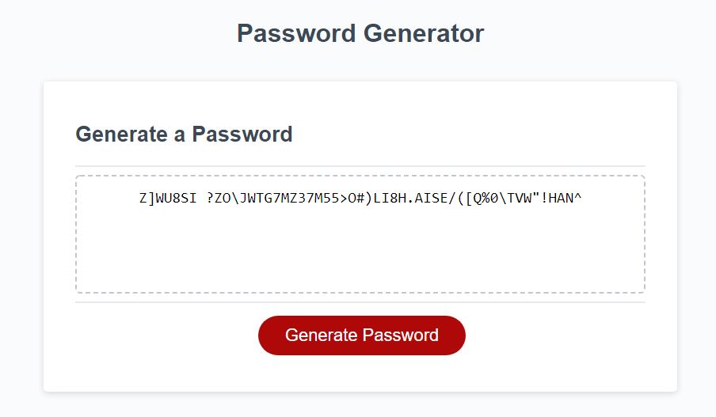

# Password-Generator
03 JavaScript: Password Generator

## Finished Project

https://cr-53.github.io/Password-Generator/Develop/index.html

## Task Description

This week's task was to code a password generator using JavaScript that catered to certain user inputted criteria. The criteria included allowing the user to specify a length for their randomly generated password between 8 & 128 characters and to select which character types they would like to be included.

## Solution

I approached this task by first breaking it down into small sections and pseudo-coding it, so I could get a better understanding of what needed to be done for each section. I then started to put together the code one function at a time, using "console.log()" to check if it they were working as intended. As I am new to JavaScript and programming in general, a lot of my time was spent googling for possible solutions and proper syntax to use for my code. 

## Debugging

After having written what seemed to be a finished solution, I soon realised that not everything was working as intended. I went back through each line of the code and re-read it to make sure it made sense and found the function where the issue was occuring. I added more "console.log()" checks to further investigate the issue, but it wasn't until re-reading the same function for the fifth time that I found the issues. I had accidentally added two subtle typos to two different variables in the same function which caused the password generator to not work (which was very frustrating). After fixing up the typos and testing the password generator, it worked as intended and met all the task requirements.

## License & copyright

© Chris Roschi, University of Adelaide Coding Bootcamp
